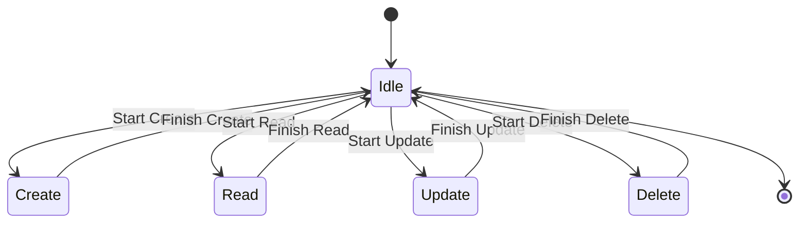

---

### **อธิบาย State Diagram**
1. **Idle**: สถานะเริ่มต้นหรือสถานะว่าง  
   - ทุกกระบวนการจะเริ่มต้นและกลับมาที่ **Idle** หลังการทำงานเสร็จสิ้น  

2. **Create**: สถานะการสร้างข้อมูลใหม่  
   - หลังสร้างเสร็จ กลับสู่ **Idle**  

3. **Read**: สถานะการอ่านข้อมูล  
   - เมื่ออ่านเสร็จ กลับสู่ **Idle**  

4. **Update**: สถานะการแก้ไขข้อมูล  
   - หลังแก้ไขเสร็จ กลับสู่ **Idle**  

5. **Delete**: สถานะการลบข้อมูล  
   - เมื่อลบเสร็จ กลับสู่ **Idle**  

---

### **โฟลว์ CRUD**
1. **Start -> Idle**: เริ่มต้นอยู่ในสถานะ Idle  
2. **Idle -> Create -> Idle**: กระบวนการสร้างข้อมูล  
3. **Idle -> Read -> Idle**: กระบวนการอ่านข้อมูล  
4. **Idle -> Update -> Idle**: กระบวนการแก้ไขข้อมูล  
5. **Idle -> Delete -> Idle**: กระบวนการลบข้อมูล  

---

### **การใช้งาน**
1. สร้างไฟล์ `crud.md`  
2. ใส่โค้ดข้างต้น  
3. ใช้ Markdown Extension (เช่น **Markdown Preview Mermaid**) เพื่อดู Diagram  

ถ้ามีคำถามเพิ่มเติมหรืออยากเพิ่มรายละเอียดใด ๆ บอกได้เลยครับ! 😊
